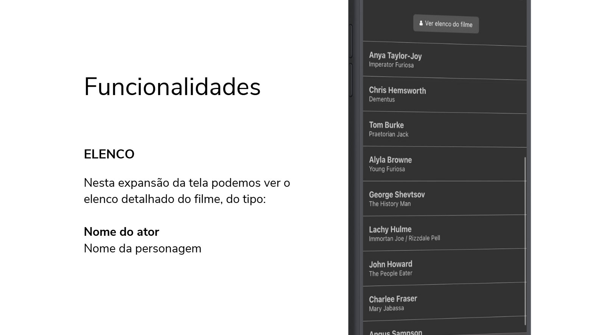

# MovieGO

## Criadores

<table>
  <tr>
    <td align="center">
      <a href="https://github.com/heitorabreu">
         
        
          <b>Heitor Xavier</b>
        
      </a>
    </td>
    <td align="center">
      <a href="https://github.com/Lucas-S-Y">
         
        
          <b>Lucas Shinji</b>
        
      </a>
    </td>
    <td align="center">
      <a href="https://github.com/vesrozeno">
         
        
          <b>Vitor Rozeno</b>
        
      </a>
    </td>
  </tr>
</table>

## Desenvolvimento

Aplicativo desenvolvido em React Native utilizando a API da TheMovieDataBase (TMDB) e informações salvas por meio do AsyncStorage.

### Funcionalidades:

- Criação de conta
- Personalização de imagem de perfil
- Vizualização de filmes em diferentes categorias
- Vizualização detalhada de filmes, contendo:
  - Título
  - Ano de lançamento
  - Diretor
  - Duração
  - Sinopse
  - Avaliações
  - Elenco
  - Imagem da capa do filme e poster maior como background
- Pesquisa por filmes utilizando palavra-chave ou substrings
- Vizualização das informações do perfil

